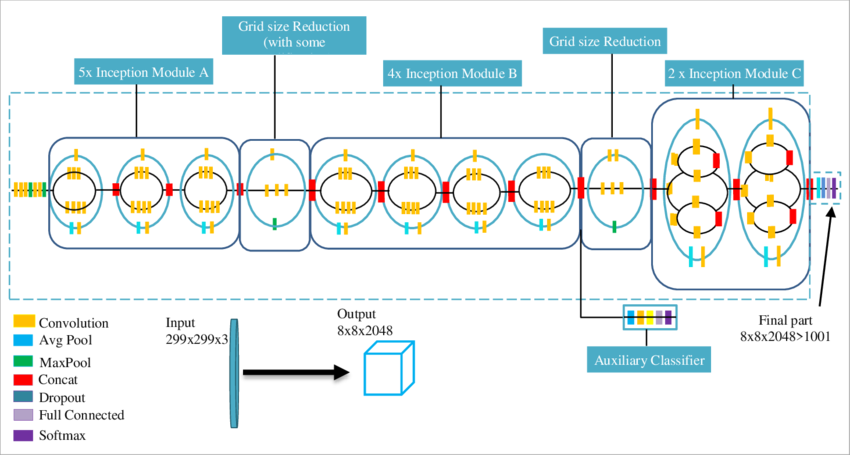

# ✨ e-Traffic : Klasifikasi rambu lalu lintas Menggunakan InceptionV3 & MobileNetV2 ✨

## Latar Belakang & Tujuan
  Rambu lalu lintas merupakan elemen penting dalam sistem transportasi jalan raya yang berfungsi memberikan informasi, peringatan, larangan, atau petunjuk kepada pengguna jalan. 
Rambu ini berperan menciptakan keteraturan, meningkatkan keselamatan, dan mengurangi risiko kecelakaan di jalan raya.

  Sebagaimana diatur dalam Pasal 28 Ayat (1) Undang-Undang Nomor 22 Tahun 2009 tentang Lalu Lintas dan Angkutan Jalan, yang berbunyi:  “Setiap jalan yang digunakan untuk lalu lintas umum wajib dilengkapi dengan perlengkapan jalan berupa rambu lalu lintas, marka jalan, alat pemberi isyarat lalu lintas, alat pengendali dan pengaman pengguna jalan, serta fasilitas pendukung lainnya.”
  Oleh karena itu, aplikasi ini dibuat untuk membantu masyarakat memahami arti dan fungsi rambu lalu lintas secara lebih mudah dan interaktif.  Silakan unggah gambar rambu, pilih model yang tersedia, dan tekan tombol Predict untuk mendapatkan hasil prediksi.

**Link Dataset yang digunakan:** [Indonesia Traffic Dataset](https://www.kaggle.com/datasets/cakrulgaming/indonesia-traffic-sign).

**InceptionV3 Architecture**

InceptionV3 adalah model CNN canggih dari Google yang dirancang untuk klasifikasi gambar dengan efisiensi tinggi. Model ini menggunakan modul Inception yang menggabungkan berbagai ukuran kernel konvolusi, memungkinkan deteksi pola pada berbagai skala. Dengan transfer learning, InceptionV3 dapat diadaptasi untuk mengenali berbagai jenis limbah rumah tangga dengan akurasi tinggi. Model ini cocok untuk dataset kompleks yang membutuhkan analisis mendalam terhadap detail visual.

**MobileNetV2 Architecture**

MobileNetV2 adalah model CNN ringan yang dirancang untuk perangkat dengan sumber daya terbatas. Menggunakan blok inverted residual dan depthwise separable convolution, model ini sangat efisien dalam memproses citra tanpa mengorbankan akurasi. MobileNetV2 ideal untuk aplikasi real-time seperti pemilahan sampah otomatis berbasis perangkat seluler, dengan kecepatan prediksi tinggi dan kebutuhan komputasi rendah.

## Dependensi & Langkah Instalasi 📃
dependencies = ["streamlit>=1.41.1", "joblib>=1.4.2", "cv>=1.0.0", "opencv-python>=4.10.0.84", "matplotlib>=3.10.0", "pillow>=11.0.0"]

1. wajib pdm init terlebih dahulu

2. install tensorflow di pdm =
- pdm info -> pastikan sudah berada di .venv
- pdm run python -m pip show tensorflow -> cek tensorflow apakah sudah di .venv
- pdm run python -m ensurepip --upgrade
- pdm run python -m pip install tensorflow
- pdm run python -c "import tensorflow as tf; print(tf._version_)"

## Struktur File 📄
- code/: Berkas kode ipynb dari model klasifikasi.
- src/uap/**app.py**: Berkas aplikasi utama yang berisi rute dan fungsi.
- src/uap/**klasifikasi_sampah.py**: Berkas penerapan dari model untuk klasifikasi dan tampilan antarmuka web.
- src/Model/: Berisi saved model berformat .h5 dari kedua arsitektur.

## Menjalankan App 💻
- Jalankan skrip dengan streamlit run ./src/app.py
- Akses aplikasi di peramban Web dengan alamat http://localhost:8501/

**Model Evaluation**

### InceptionV3 Model ✨

Plot diatas menunjukkan bahwa *Model Accuracy* sangat baik dan stabil, dan *Model Loss* mengalami sangat baik mempelajari pola sehingga loss menurun.

Gambar diatas menunjukkan *Classification Report* dari Model InceptionV3 menghasilkan nilai akurasi sebesar *95%* yang dapat digolongkan optimal.

Confusion Matrix tersebut menunjukkan bahwa model mampu memprediksi citra dengan cukup baik dengan kesalahan yang sedikit.

### MobileNetV2 Model ✨

Plot diatas menunjukkan bahwa *Model Accuracy* sangat baik dan stabil, dan *Model Loss* mengalami sangat baik mempelajari pola sehingga loss menurun.

Gambar diatas menunjukkan *Classification Report* dari Model MobileNetV2 menghasilkan nilai akurasi sebesar **94%** yang dapat digolongkan cukup optimal.

Confusion Matrix tersebut menunjukkan bahwa model mampu memprediksi citra dengan cukup baik dengan kesalahan yang sedikir.

## Hasil Analisis
Berdasarkan perbandingan dari kedua arsitektur di atas, InceptionV3 menjadi model yang unggul apabila dinilai dari segi akurasi, namun grafik loss mengalami overfit. Sedangkan apabila dinilai dari segi grafik validasi MobileNetV2 lebih unggul karena lebih baik namun dari segi akurasi berada di bawah InceptionV3. 
Oleh karena itu, memungkinkan perlunya dilakukan perbaikan dalam pre-processing data seperti ditambahkannya augmentasi. Serta perlu ditambahkannya nilai epoch agar meningkatkan performa model.

## Local Web Deployment

### Tampilan HomePage

### Tampilan HomePage Setelah Upload Image

### Tampilan Prediction Result

## Link for download Model:
- Inception_V3 : (https://drive.google.com/file/d/164Nbnh64DCcKQORMwQN-5iCkom9YoRV1/view?usp=sharing)
- MobileNet_V2 : (https://drive.google.com/file/d/15GprwIb6lW9Sd2bSMQB5laZ_8KNWnTj0/view?usp=sharing)

## Author 👨‍💻 
- Muhammad Mazen Fayiz Birizqie | 202110370311513
